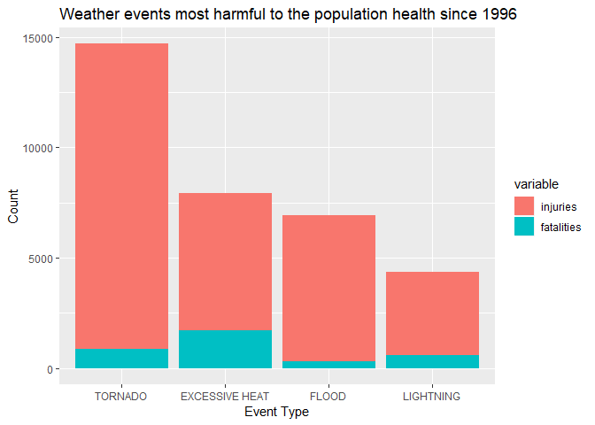
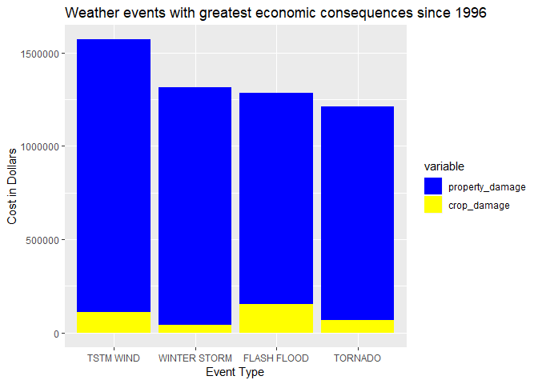

---
title: "Identification of NOAA US storm events most harmful with respect to population health and those with greatest economic consequences between 1996 and 2011"
author: "Nathalie Descusse-Brown"
date: "January 8, 2019"
output: 
  html_document:
    keep_md: true
    
---

## Synopsis 
In this report we aim to explore which storms and other severe weather events can cause both public health and economic problems for communities and municipalities. Specifically we are trying to answer the following two questions: 1) Across the United States, which types of events are most harmful with respect to population health? 2) Across the United States, which types of events have the greatest economic consequences? To answer these questions, we obtained storm data from the U.S. National Oceanic and Atmospheric Administration's (NOAA) storm database.The events in the database start in the year 1950 and end in November 2011. However, to make a meaningful comparison we only used data from 1996 onwards on this was the first year where all weather events were reported. From these data, we found that the most event most harmful to the population, which we defined as the events leading to a combined 70% of all injuries and fatalities, are tornado, excessive heat, flood and lightning. A similar analysis run to identify the events with the greatest economic consequences shows that 70% of all combined property and crop damage is caused by thunderstorm wind, winter storm, flash flood and tornado.

## Data Processing
From the [U.S. National Oceanic and Atmospheric Administration's (NOAA) storm database](https://d396qusza40orc.cloudfront.net/repdata%2Fdata%2FStormData.csv.bz2) we obtained data on storm and other severe events recorded between 1950 and 2011 in the country.


### Reading the data
We first read the data from the zip file. The data is a comma delimited file.

```r
fileUrl <- "https://d396qusza40orc.cloudfront.net/repdata%2Fdata%2FStormData.csv.bz2"
download.file(fileUrl,destfile="NOAAstorm.csv.bz2")
stormdata <- read.csv("NOAAstorm.csv.bz2")
```

We then check the different column names for the file

```r
names(stormdata)
```

```
##  [1] "STATE__"    "BGN_DATE"   "BGN_TIME"   "TIME_ZONE"  "COUNTY"    
##  [6] "COUNTYNAME" "STATE"      "EVTYPE"     "BGN_RANGE"  "BGN_AZI"   
## [11] "BGN_LOCATI" "END_DATE"   "END_TIME"   "COUNTY_END" "COUNTYENDN"
## [16] "END_RANGE"  "END_AZI"    "END_LOCATI" "LENGTH"     "WIDTH"     
## [21] "F"          "MAG"        "FATALITIES" "INJURIES"   "PROPDMG"   
## [26] "PROPDMGEXP" "CROPDMG"    "CROPDMGEXP" "WFO"        "STATEOFFIC"
## [31] "ZONENAMES"  "LATITUDE"   "LONGITUDE"  "LATITUDE_E" "LONGITUDE_"
## [36] "REMARKS"    "REFNUM"
```

### Pre-processing data required to address Question 1 ("Across the U.S., which types of events are most harmful with respect to population health?")

### Reduce dataset to columns required
First we reduce the size of the dataset used for the analysis by selecting only the columns we will require to address Question 1, namely "EVTYPE","FATALITIES","INJURIES","PROPDMG","PROPDMGEXP","CROPDMG","CROPDMGEXP". We also identify the unique event types associated with at least one injury or fatality and only post 1996 (as this is the year where NOAA start recording all event types) in order to further reduce the size of the dataset for manipulation.

```r
library(dplyr)
```

```
## 
## Attaching package: 'dplyr'
```

```
## The following objects are masked from 'package:stats':
## 
##     filter, lag
```

```
## The following objects are masked from 'package:base':
## 
##     intersect, setdiff, setequal, union
```

```r
stormdatacol <- stormdata %>% select("BGN_DATE","EVTYPE","FATALITIES","INJURIES","PROPDMG","PROPDMGEXP","CROPDMG","CROPDMGEXP")
ind <-which((stormdatacol$FATALITIES!=0 | stormdatacol$INJURIES!=0 | stormdatacol$PROPDMG!=0 | stormdatacol$CROPDMG!=0) & grepl("1996|1997|1998|1999|200|210",stormdatacol$BGN_DATE) )
stormdata1 <- stormdatacol[ind,]
stormdata1$EVTYPE <- as.character(stormdata1$EVTYPE)

## Then I introduced a second data set that will be used for the sensitivity analysis performed to check results when event type typos are addressed further down
stormdata2 <- stormdatacol[ind,]
stormdata2$EVTYPE <- as.character(stormdata2$EVTYPE)
```


The column we are interested in in order to address question 1 are the Fatalities and Injuries columns. Here we extract that column and print a brief summary.


```r
fatal <- stormdata1$FATALITIES
summary(stormdata1$FATALITIES)
```

```
##     Min.  1st Qu.   Median     Mean  3rd Qu.     Max. 
##  0.00000  0.00000  0.00000  0.04435  0.00000 99.00000
```

```r
injur <- stormdata1$INJURIES
summary(injur)
```

```
##     Min.  1st Qu.   Median     Mean  3rd Qu.     Max. 
##   0.0000   0.0000   0.0000   0.2934   0.0000 800.0000
```

We then check for missing values to see what proportion, if any, of the observations are missing (i.e. coded as NA).

```r
mean(is.na(fatal)) 
```

```
## [1] 0
```

```r
mean(is.na(injur))
```

```
## [1] 0
```
We can see from this there are no missing data in the Fatalities and Injuries column.


### Checking data required to address Question 2 ("Across the United States, which types of events have the greatest economic consequences?")
The column we are interested in in order to address question 1 are the PROPDMG (cost of property damage as a number),PROPDMGEXP (which represents a multiplier for the PROPDMG cost, following the assumptions listed [here](https://rstudio-pubs-static.s3.amazonaws.com/58957_37b6723ee52b455990e149edde45e5b6.html)), CROPDMG (cost of crop damage as a number), and CROPDMGEXP (which represents a multiplier for the PROPDMG cost, following the assumptions listed [here](https://rstudio-pubs-static.s3.amazonaws.com/58957_37b6723ee52b455990e149edde45e5b6.html)). We turned the PROPDMG and CROPDMG columns into actual numbers by adding the units from the PROPDMGEXP and CROPDMGEXP columns. 


```r
for (i in 1:length(stormdata)) {
        if (stormdata1$PROPDMGEXP[i]=="H"|stormdata1$PROPDMGEXP[i]=="h") {
                stormdata1$PROPDMG[i] <- stormdata1$PROPDMG[i] * 100
        }
        else if (stormdata1$PROPDMGEXP[i]=="K" | stormdata1$PROPDMGEXP[i]=="k") {
                stormdata1$PROPDMG[i] <- stormdata1$PROPDMG[i] * 1000
        }
        else if (stormdata1$PROPDMGEXP[i]=="M" | stormdata1$PROPDMGEXP[i]=="m") {
                stormdata1$PROPDMG[i] <- stormdata1$PROPDMG[i] * 1000000
        }
        else if (stormdata1$PROPDMGEXP[i]=="B" | stormdata1$PROPDMGEXP[i]=="b") {
                stormdata1$PROPDMG[i] <- stormdata1$PROPDMG[i] * 1000000000
        }
        else if (stormdata1$PROPDMGEXP[i]=="-" | stormdata1$PROPDMGEXP[i]=="?" | stormdata1$PROPDMGEXP[i]=="")         {
                stormdata1$PROPDMG[i] <- stormdata1$PROPDMG[i] * 0
        }
        else if (stormdata1$PROPDMGEXP[i] %in% c("0","1","2","3","4","5","6","7","8") ) {
                stormdata1$PROPDMG[i] <- stormdata1$PROPDMG[i] * 10
        }
        if (stormdata1$CROPDMGEXP[i]=="H"|stormdata1$CROPDMGEXP[i]=="h") {
                stormdata1$CROPDMG[i] <- stormdata1$CROPDMG[i] * 100
        }
        else if (stormdata1$CROPDMGEXP[i]=="K" | stormdata1$CROPDMGEXP[i]=="k") {
                stormdata1$CROPDMG[i] <- stormdata1$CROPDMG[i] * 1000
        }
        else if (stormdata1$CROPDMGEXP[i]=="M" | stormdata1$CROPDMGEXP[i]=="m") {
                stormdata1$CROPDMG[i] <- stormdata1$CROPDMG[i] * 1000000
        }
        else if (stormdata1$CROPDMGEXP[i]=="B" | stormdata1$CROPDMGEXP[i]=="b") {
                stormdata1$CROPDMG[i] <- stormdata1$CROPDMG[i] * 1000000000
        }
        else if (stormdata1$CROPDMGEXP[i]=="-" | stormdata1$CROPDMGEXP[i]=="?" | stormdata1$CROPDMGEXP[i]=="")         {
                stormdata1$CROPDMG[i] <- stormdata1$CROPDMG[i] * 0
        }
        else if (stormdata1$CROPDMGEXP[i] %in% c("0","1","2","3","4","5","6","7","8") ) {
                stormdata1$CROPDMG[i] <- stormdata1$CROPDMG[i] * 10
        }
}
```

The column we are interested in in order to address question 2 are the PROPDMG and CROPDMG columns. Here we extract that column and print a brief summary.


```r
propdmg <- stormdata1$PROPDMG
summary(propdmg)
```

```
##     Min.  1st Qu.   Median     Mean  3rd Qu.     Max. 
##      0.0      2.0      6.0     50.8     25.0 595000.0
```

```r
cropdmg <- stormdata1$CROPDMG
summary(cropdmg)
```

```
##     Min.  1st Qu.   Median     Mean  3rd Qu.     Max. 
##     0.00     0.00     0.00     6.57     0.00 38000.00
```

We then check for missing values to see what proportion, if any, of the observations are missing (i.e. coded as NA).

```r
mean(is.na(propdmg)) 
```

```
## [1] 0
```

```r
mean(is.na(cropdmg))
```

```
## [1] 0
```
We can see from this there are no missing data in the PROPDMG and Injuries CROPDMG.

## Results

### Answer to Question 1 ("Across the U.S., which types of events are most harmful with respect to population health?")

The analysis extracts the weather event types most harmful to the population based on the number of fatalities. Most harmful events are defined as the event types that caused 70% of all fatalities reported in the database. 

The analysis also extracts the weather event types most harmful to the population based on the number of injuries. Most harmful events are defined as the event types that caused 70% of all injuries reported in the database.


```r
fatalevents <- tapply(fatal,stormdata1$EVTYPE,sum)
fataleventsrank <- sort(fatalevents, decreasing = TRUE)
n <- 0
for (i in 1:length(fataleventsrank)) {
        if (n <= 0.7*sum(fatalevents)) {
        n <- n + fataleventsrank[i]
        }
  
} 
```


```r
injurevents <- tapply(injur,stormdata1$EVTYPE,sum)
injureventsrank <- sort(injurevents, decreasing = TRUE)
n <- 0
for (i in 1:length(injureventsrank)) {
        if (n <= 0.7*sum(injurevents)) {
        n <- n + injureventsrank[i]
        }
  
} 
```

We then looked at the combination of injuries and fatalities so see which weather event had the highest combined numbers and took these events as the events most harmful to the population. A threshold of 70% of the overall number of fatalities and injuries was used to define the events most harmful to the population.


```r
library(reshape2)
library(ggplot2)
dfinjur <- as.data.frame(as.numeric(injureventsrank),row.names=names(injureventsrank))
names(dfinjur)<- "injuries"
dfinjur$eventtype <- row.names(dfinjur)
dffatal <- as.data.frame(as.numeric(fataleventsrank),row.names=names(fataleventsrank))
names(dffatal)<- "fatalities"
dffatal$eventtype <- row.names(dffatal)
df <- merge(dfinjur,dffatal)
df$sum<- df$injuries + df$fatalities
dfrank <- df[order(df$sum, decreasing=TRUE),]
m <- 0
l1 <- 0
for (j in 1:length(dfrank)) {
        if (m <= 0.7*sum(dfrank$sum)) {
        m <- m + dfrank$sum[i]
        l1 <-j
        }
  
} 
dfplot <- melt(dfrank[1:l1,],id.vars = "eventtype")
dfplot$eventtype <- factor(as.character(dfplot$eventtype), levels = unique(as.character(dfplot$eventtype[order(-dfplot$value)])))
ggplot(dfplot[which(dfplot$variable!="sum",arr.ind=TRUE),], aes(fill=variable, y=value, x=eventtype)) +
     geom_bar( stat="identity") + ggtitle("Weather events most harmful to the population health since 1996") +
     xlab("Event Type") + ylab("Count")        
```

<!-- -->

As can be seen, 70% of the overall number of fatalities and injuries are attributable to 4 event types only, namely TORNADO, EXCESSIVE HEAT, FLOOD, LIGHTNING .


### Sensitivity Analysis for Question 1
We also want to check the sensitivity of the results to the description of the event type as some typos led to a unique list of 985 event types compared to the official list of 48 event types. How does this affect the above conclusions? We used the amatch function in the stringdist package for this and tried a few maxDist values before choosing the value that seems to identify the closest match and exclude other values that we decide to disregard as they do not fit an official category.

```r
library(stringdist)
```

```
## Warning: package 'stringdist' was built under R version 3.5.2
```

```r
formalEVTYPE <- c("","ASTRONOMICAL LOW TIDE","AVALANCHE","BLIZZARD","COASTAL FLOOD","COLD/WIND CHILL","DEBRIS FLOW","DENSE FOG","DENSE SMOKE","DROUGHT","DUST DEVIL","DUST STORM","EXCESSIVE HEAT","EXTREME COLD/WIND CHILL","FLASH FLOOD","FLOOD","FREEZING FOG","FROST/FREEZE","FUNNEL CLOUD","HAIL","HEAT","HEAVY RAIN","HEAVY SNOW","HIGH SURF","HIGH WIND","HURRICANE/TYPHOON","ICE STORM","LAKESHORE FLOOD","LAKE-EFFECT SNOW","LIGHTNING","MARINE HAIL","MARINE HIGH WIND","MARINE STRONG WIND","MARINE THUNDERSTORM WIND","RIP CURRENT","SEICHE","SLEET","STORM TIDE","STRONG WIND","TSTM WIND","TORNADO","TROPICAL DEPRESSION","TROPICAL STORM","TSUNAMI","VOLCANIC ASH","WATERSPOUT","WILDFIRE","WINTER STORM","WINTER WEATHER")
matchstr <- amatch((stormdata2$EVTYPE),formalEVTYPE,maxDist=6)
for (k in 1:length(matchstr)) {
        stormdata2$EVTYPE[k] <- formalEVTYPE[matchstr[k]]
}
```


```r
fatal2 <- stormdata2$FATALITIES
summary(fatal2)
```

```
##     Min.  1st Qu.   Median     Mean  3rd Qu.     Max. 
##  0.00000  0.00000  0.00000  0.04435  0.00000 99.00000
```

```r
injur2 <- stormdata2$INJURIES
summary(injur2)
```

```
##     Min.  1st Qu.   Median     Mean  3rd Qu.     Max. 
##   0.0000   0.0000   0.0000   0.2934   0.0000 800.0000
```

We then check for missing values to see what proportion, if any, of the observations are missing (i.e. coded as NA).

```r
mean(is.na(fatal2)) 
```

```
## [1] 0
```

```r
mean(is.na(injur2))
```

```
## [1] 0
```


```r
fatalevents2 <- tapply(fatal2,as.factor(stormdata2$EVTYPE),sum)
fataleventsrank2 <- sort(fatalevents2, decreasing = TRUE)
n <- 0
for (i in 1:length(fataleventsrank2)) {
        if (n <= 0.7*sum(fatalevents2)) {
        n <- n + fataleventsrank2[i]
        }
  
} 
```


```r
injurevents2 <- tapply(injur2,stormdata2$EVTYPE,sum)
injureventsrank2 <- sort(injurevents2, decreasing = TRUE)
n <- 0
for (i in 1:length(injureventsrank2)) {
        if (n <= 0.7*sum(injurevents2)) {
        n <- n + injureventsrank2[i]
        }
  
} 
```

We then looked at the combination of injuries and fatalities so see which weather event had the highest combined numbers and took these events as the events most harmful to the population. A threshold of 70% of the overall number of fatalities and injuries was used to define the events most harmful to the population.


```r
dfinjur2 <- as.data.frame(as.numeric(injureventsrank2),row.names=names(injureventsrank2))
names(dfinjur2)<- "injuries"
dfinjur2$eventtype <- row.names(dfinjur2)
dffatal2 <- as.data.frame(as.numeric(fataleventsrank2),row.names=names(fataleventsrank2))
names(dffatal2)<- "fatalities"
dffatal2$eventtype <- row.names(dffatal2)
df2 <- merge(dfinjur2,dffatal2)
df2$sum <- df2$injuries + df2$fatalities
dfrank2 <- df2[order(df2$sum, decreasing=TRUE),]
m <- 0
l1 <- 0
for (j in 1:length(dfrank2)) {
        if (m <= 0.7*sum(dfrank2$sum)) {
        m <- m + dfrank2$sum[i]
        l1 <-j
        }
  
} 
dfplot2 <- melt(dfrank2[1:l1,],id.vars = "eventtype")
```

We can see that 70% of the overall number of fatalities and injuries are attributable to 4 event types only, namely TORNADO, EXCESSIVE HEAT, FLOOD, LIGHTNING. So we can conclude that the actual ranking of the weather events most harmful to the population has not changed in the sensitivity analysis.

### Answer to Question 2 ("Across the United States, which types of events have the greatest economic consequences?")

The analysis extracts the weather event types with the greatest economic consequences based on the cost of property damage. The event with the greatest economic consequences are defined as the event types that caused 70% of the total cost of property damage caused by weather events since 1996. 

The analysis also extracts the  weather event types with the greatest economic consequences based on the cost of crop damage. The event with the greatest economic consequences are defined as the event types that caused 70% of the total cost of crop damage caused by weather events since 1996. 


```r
propertyevents <- tapply(propdmg,stormdata1$EVTYPE,sum)
propertyeventsrank <- sort(propertyevents, decreasing = TRUE)
n <- 0
for (i in 1:length(propertyeventsrank)) {
        if (n <= 0.7*sum(propertyevents)) {
        n <- n + propertyeventsrank[i]
        }
  
} 
```


```r
cropevents <- tapply(cropdmg,stormdata1$EVTYPE,sum)
cropeventsrank <- sort(cropevents, decreasing = TRUE)
n <- 0
for (i in 1:length(cropeventsrank)) {
        if (n <= 0.7*sum(cropevents)) {
        n <- n + cropeventsrank[i]
        }
  
} 
```

We then looked at the combination of property damage cost and crop damage cost so see which weather event had the highest combined numbers and took these events as the events with the greatest economic consequences. A threshold of 70% of the overall cost of both property damage and crop damage was used to define the events with the greatest economic consequences.


```r
library(reshape2)
library(ggplot2)
dfpropdmg <- as.data.frame(as.numeric(propertyeventsrank),row.names=names(propertyeventsrank))
names(dfpropdmg)<- "property_damage"
dfpropdmg$eventtype <- row.names(dfpropdmg)
dfcropdmg <- as.data.frame(as.numeric(cropeventsrank),row.names=names(cropeventsrank))
names(dfcropdmg)<- "crop_damage"
dfcropdmg$eventtype <- row.names(dfcropdmg)
dfecon <- merge(dfpropdmg,dfcropdmg)
dfecon$sum<- dfecon$property_damage + dfecon$crop_damage
dfeconrank <- dfecon[order(dfecon$sum, decreasing=TRUE),]
m <- 0
l1 <- 0
for (j in 1:length(dfeconrank)) {
        if (m <= 0.7*sum(dfeconrank$sum)) {
        m <- m + dfeconrank$sum[i]
        l1 <-j
        }
  
} 
dfeconplot <- melt(dfeconrank[1:l1,],id.vars = "eventtype")
dfeconplot$eventtype <- factor(as.character(dfeconplot$eventtype), levels = unique(as.character(dfeconplot$eventtype[order(-dfeconplot$value)])))
ggplot(dfeconplot[which(dfeconplot$variable!="sum",arr.ind=TRUE),], aes(fill=variable, y=value, x=eventtype)) +
     geom_bar( stat="identity") + ggtitle("Weather events with greatest economic consequences since 1996") +
     xlab("Event Type") + ylab("Cost in Dollars") + 
    scale_fill_manual(values=c("blue", "yellow"))
```

<!-- -->

### Sensitivity Analysis for Question 2
We also want to check the sensitivity of the results to the description of the event type as some typos led to a unique list of 985 event types compared to the official list of 48 event types. How does this affect the above conclusions? We approach it in a similar manner to the way we approached the sensitivity analysis to Question 1, y using the stormdata2 dataset, where we attempted to match the dataset event type with the 48 official NOAA even types.


```r
for (i in 1:length(stormdata)) {
        if (stormdata2$PROPDMGEXP[i]=="H"|stormdata2$PROPDMGEXP[i]=="h") {
                stormdata2$PROPDMG[i] <- stormdata2$PROPDMG[i] * 100
        }
        else if (stormdata2$PROPDMGEXP[i]=="K" | stormdata2$PROPDMGEXP[i]=="k") {
                stormdata2$PROPDMG[i] <- stormdata2$PROPDMG[i] * 1000
        }
        else if (stormdata2$PROPDMGEXP[i]=="M" | stormdata2$PROPDMGEXP[i]=="m") {
                stormdata2$PROPDMG[i] <- stormdata2$PROPDMG[i] * 1000000
        }
        else if (stormdata2$PROPDMGEXP[i]=="B" | stormdata2$PROPDMGEXP[i]=="b") {
                stormdata2$PROPDMG[i] <- stormdata2$PROPDMG[i] * 1000000000
        }
        else if (stormdata2$PROPDMGEXP[i]=="-" | stormdata2$PROPDMGEXP[i]=="?" | stormdata2$PROPDMGEXP[i]=="")         {
                stormdata2$PROPDMG[i] <- stormdata2$PROPDMG[i] * 0
        }
        else if (stormdata2$PROPDMGEXP[i] %in% c("0","1","2","3","4","5","6","7","8") ) {
                stormdata2$PROPDMG[i] <- stormdata2$PROPDMG[i] * 10
        }
        if (stormdata2$CROPDMGEXP[i]=="H"|stormdata2$CROPDMGEXP[i]=="h") {
                stormdata2$CROPDMG[i] <- stormdata2$CROPDMG[i] * 100
        }
        else if (stormdata2$CROPDMGEXP[i]=="K" | stormdata2$CROPDMGEXP[i]=="k") {
                stormdata2$CROPDMG[i] <- stormdata2$CROPDMG[i] * 1000
        }
        else if (stormdata2$CROPDMGEXP[i]=="M" | stormdata2$CROPDMGEXP[i]=="m") {
                stormdata2$CROPDMG[i] <- stormdata2$CROPDMG[i] * 1000000
        }
        else if (stormdata2$CROPDMGEXP[i]=="B" | stormdata2$CROPDMGEXP[i]=="b") {
                stormdata2$CROPDMG[i] <- stormdata2$CROPDMG[i] * 1000000000
        }
        else if (stormdata2$CROPDMGEXP[i]=="-" | stormdata2$CROPDMGEXP[i]=="?" | stormdata2$CROPDMGEXP[i]=="")         {
                stormdata2$CROPDMG[i] <- stormdata2$CROPDMG[i] * 0
        }
        else if (stormdata2$CROPDMGEXP[i] %in% c("0","1","2","3","4","5","6","7","8") ) {
                stormdata2$CROPDMG[i] <- stormdata2$CROPDMG[i] * 10
        }
}
```


```r
propdmg2 <- stormdata2$PROPDMG
summary(propdmg2)
```

```
##     Min.  1st Qu.   Median     Mean  3rd Qu.     Max. 
##      0.0      2.0      6.0     50.8     25.0 595000.0
```

```r
cropdmg2 <- stormdata2$CROPDMG
summary(cropdmg2)
```

```
##     Min.  1st Qu.   Median     Mean  3rd Qu.     Max. 
##     0.00     0.00     0.00     6.57     0.00 38000.00
```


```r
propertyevents2 <- tapply(propdmg2,stormdata2$EVTYPE,sum)
propertyeventsrank2 <- sort(propertyevents2, decreasing = TRUE)
n <- 0
for (i in 1:length(propertyeventsrank2)) {
        if (n <= 0.7*sum(propertyevents2)) {
        n <- n + propertyeventsrank2[i]
        }
  
} 
```


```r
cropevents2 <- tapply(cropdmg2,stormdata2$EVTYPE,sum)
cropeventsrank2 <- sort(cropevents2, decreasing = TRUE)
n <- 0
for (i in 1:length(cropeventsrank2)) {
        if (n <= 0.7*sum(cropevents2)) {
        n <- n + cropeventsrank2[i]
        }
  
} 
```

We then looked at the combination of property damage cost and crop damage cost so see which weather event had the highest combined numbers and took these events as the events with the greatest economic consequences. A threshold of 70% of the overall cost of both property damage and crop damage was used to define the events with the greatest economin consequences.


```r
dfpropdmg2 <- as.data.frame(as.numeric(propertyeventsrank2),row.names=names(propertyeventsrank2))
names(dfpropdmg2)<- "property_damage"
dfpropdmg2$eventtype <- row.names(dfpropdmg2)
dfcropdmg2 <- as.data.frame(as.numeric(cropeventsrank2),row.names=names(cropeventsrank2))
names(dfcropdmg2)<- "crop_damage"
dfcropdmg2$eventtype <- row.names(dfcropdmg2)
dfecon2 <- merge(dfpropdmg2,dfcropdmg2)
dfecon2$sum<- dfecon2$property_damage + dfecon2$crop_damage
dfeconrank2 <- dfecon2[order(dfecon2$sum, decreasing=TRUE),]
m <- 0
l1 <- 0
for (j in 1:length(dfeconrank2)) {
        if (m <= 0.7*sum(dfeconrank2$sum)) {
        m <- m + dfeconrank2$sum[i]
        l1 <-j
        }
  
} 
dfeconplot2 <- melt(dfeconrank2[1:l1,],id.vars = "eventtype")
```

We can see that 70% of the overall cost of property damage and crop damage are attributable to 4 event types only, namely TSTM WIND, WINTER STORM, FLASH FLOOD, TORNADO. So we can conclude that the actual ranking of the weather events most harmful to the population has not changed in the sensitivity analysis.
